[dbrsolarepc.com](https://www.dbrsolarepc.com/) &nbsp;·&nbsp;
[linkedin](https://www.linkedin.com/in/bhuvan-sambari-3b58b5278/) &nbsp;·&nbsp;
[leetcode](https://leetcode.com/u/sbhuvansambari/) &nbsp;·&nbsp;
[email](mailto:maha123dev45@gmail.com)

> Robotics & AI Engineer at Vellore Institute of Technology (VIT Chennai '27). 
> Neuromorphic architectures, autonomous perception, and production systems.

I engineer biologically inspired neural architectures, autonomous robotics pipelines, and scalable web 
platforms. Right now that's [neuromorphic-snn](https://github.com/BhuvanSambari) — energy-efficient spiking neural networks 
for edge-AI autonomy. Also deployed [dbrsolarepc.com](https://www.dbrsolarepc.com/) and real-time RPLIDAR SLAM on mobile rovers.

<samp>python &nbsp; c++ &nbsp; ros2 &nbsp; pytorch &nbsp; opencv &nbsp; snn &nbsp; react &nbsp; django &nbsp; postgres &nbsp; docker &nbsp; linux</samp>

**[neuromorphic-snn-brain](https://github.com/BhuvanSambari)** &nbsp;·&nbsp; <samp>python, snn, neuromorphic</samp> 
Energy-efficient neuromorphic framework combining Spiking Neural Networks and animalistic 
autonomy loops with >60% reduced temporal processing overhead under strict hardware limits.

**[dbr-solar-epc](https://www.dbrsolarepc.com/)** &nbsp;·&nbsp; <samp>full stack, react, django, postgres</samp> 
Production enterprise solar EPC web platform serving corporate & industrial energy clients. 
Sub-1.2s First Contentful Paint with 95+ Lighthouse score across desktop and mobile.

**[rover-visual-odometry](https://github.com/BhuvanSambari)** &nbsp;·&nbsp; <samp>opencv, python, deep learning</samp> 
Real-time multi-frame ego-motion estimation and optical flow tracking pipeline computing 
sub-30ms per-frame camera pose recovery with RANSAC outlier rejection.

**[rplidar-slam-mapping](https://github.com/BhuvanSambari)** &nbsp;·&nbsp; <samp>ros2, gazebo, rviz, c++</samp> 
Simultaneous Localization and Mapping on physical differential rovers with zero-drift 
laser scan matching, costmap tuning, and occupancy grids.

**[crowd-fall-detection](https://github.com/BhuvanSambari)** &nbsp;·&nbsp; <samp>opencv, pose estimation, spatial heatmaps</samp> 
High-density crowd anomaly tracking and low-latency (<150ms) fall-detection architecture 
with edge-local video inference preserving data privacy.

Every graphic here is generated, not embedded from anyone else's server. 
`ascii.svg` is a photo pushed through a character ramp by 
[`scripts/make_portrait.py`](scripts/make_portrait.py); the stat graphics and 
these section headings are drawn by [a scheduled action](.github/workflows/stats.yml) 
straight from the GitHub GraphQL API, once a day, committing only what changed.

They animate with SMIL inside the SVG, because GitHub strips scripts from 
READMEs — and since nothing loads from a third party, nothing here can 
rate-limit or go dark. The headings are SVGs for the same reason: GitHub also 
strips CSS, so an image is the only way to put this page's own typeface on them.

The typeface is [JetBrains Mono](scripts/fonts), subset to just the characters 
each graphic draws and inlined as base64. That isn't only for looks: the 
portrait's grid assumes an advance width of exactly 0.600 em, and a viewer whose 
default monospace is narrower would otherwise see it squeezed.

Language totals cover public repositories only. `year.svg` uses the portrait's 
character ramp: `:` `+` `#` `@`, quiet to loud.
